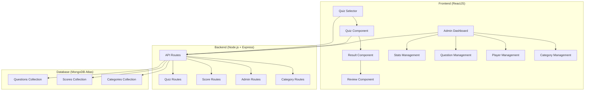

# 🎯 Quiz App - Hệ Thống Quiz Tương Tác Đa Chức Năng

[](https://reactjs.org/)
[](https://nodejs.org/)
[](https://www.mongodb.com/atlas)
[](https://expressjs.com/)
[](https://vitejs.dev/)

> **Một ứng dụng Quiz hiện đại với giao diện đẹp mắt, hệ thống quản trị toàn diện và trải nghiệm người dùng tối ưu**

## 🌟 Tổng Quan Dự Án

Quiz App là một hệ thống quiz tương tác được phát triển với kiến trúc **Full-Stack** hiện đại, tích hợp **Frontend ReactJS** và **Backend Node.js + Express + MongoDB Atlas**. Hệ thống cung cấp trải nghiệm quiz đa dạng với các chủ đề khác nhau, bảng xếp hạng động và giao diện quản trị chuyên nghiệp.

### 🎯 Điểm Nổi Bật

- ✨ **Giao diện hiện đại** với thiết kế responsive và glassmorphism effects
- 🏆 **Hệ thống xếp hạng** với leaderboard real-time
- 👤 **Quản lý người chơi** với tên tùy chỉnh và random name generator
- 📊 **Dashboard quản trị** với CRUD operations đầy đủ
- 🔐 **Bảo mật** với admin authentication
- 📱 **Responsive design** tối ưu cho mọi thiết bị
- 🚀 **Performance** với lazy loading và optimization

## 🏗️ Kiến Trúc Hệ Thống



## 🛠️ Công Nghệ Sử Dụng

### Frontend
- **React 18.2.0** - UI Framework với hooks và functional components
- **Vite** - Build tool hiện đại với HMR
- **CSS3** - Styling với Grid, Flexbox và animations
- **Responsive Design** - Mobile-first approach

### Backend
- **Node.js 18+** - Runtime environment
- **Express.js 4.18.2** - Web framework
- **MongoDB Atlas** - Cloud database
- **Mongoose 8.0.3** - ODM cho MongoDB
- **CORS** - Cross-origin resource sharing
- **Rate Limiting** - API protection

### DevOps & Deployment
- **Render.com** - Cloud hosting platform
- **Environment Variables** - Configuration management
- **Git** - Version control

## 🚀 Tính Năng Chính

### 🎮 Trải Nghiệm Người Chơi
- **Chọn chủ đề đa dạng**: Thủ đô thế giới, Tiếng Anh chuyên ngành, Bóng đá
- **Tùy chỉnh số câu hỏi**: 5-30 câu hỏi tùy chọn
- **Random quiz**: Câu hỏi ngẫu nhiên từ tất cả chủ đề
- **Tên người chơi**: Nhập tên hoặc random name generator
- **Real-time feedback**: Hiển thị kết quả ngay lập tức
- **Review mode**: Xem lại câu trả lời và đáp án

### 🏆 Hệ Thống Xếp Hạng
- **Leaderboard**: Top 10 người chơi xuất sắc nhất
- **Score tracking**: Lưu trữ điểm số và thời gian
- **Player statistics**: Thống kê chi tiết từng người chơi

### 🔧 Dashboard Quản Trị
- **Thống kê tổng quan**: Overview dashboard với charts
- **Quản lý câu hỏi**: CRUD operations với pagination
- **Quản lý danh mục**: Tạo, sửa, xóa categories
- **Quản lý người chơi**: Xem chi tiết và xóa players
- **Authentication**: Admin key protection
- **Responsive admin UI**: Tối ưu cho mọi thiết bị

## 📊 Cấu Trúc Database

### Questions Collection
```javascript
{
  category: String,        // Chủ đề câu hỏi
  question: String,        // Nội dung câu hỏi
  options: [String],       // Các lựa chọn
  answer: String,         // Đáp án đúng
  createdAt: Date,        // Thời gian tạo
  updatedAt: Date         // Thời gian cập nhật
}
```

### Scores Collection
```javascript
{
  name: String,           // Tên người chơi
  points: Number,         // Điểm số
  createdAt: Date        // Thời gian chơi
}
```

### Categories Collection
```javascript
{
  name: String,           // Tên danh mục
  emoji: String,         // Icon danh mục
  description: String,    // Mô tả
  createdAt: Date,       // Thời gian tạo
  updatedAt: Date       // Thời gian cập nhật
}
```

## 🚀 Cài Đặt và Chạy Dự Án

### Prerequisites
- Node.js 18+ 
- npm hoặc yarn
- MongoDB Atlas account

### 1. Clone Repository
```bash
git clone https://github.com/yourusername/quiz-app.git
cd quiz-app
```

### 2. Backend Setup
```bash
cd backend
npm install
cp env.example .env
# Cấu hình MongoDB URI và Admin Key trong .env
npm run dev
```

### 3. Frontend Setup
```bash
cd frontend
npm install
cp env.example .env.local
# Cấu hình API URL trong .env.local
npm run dev
```

### 4. Database Migration
```bash
cd backend
npm run migrate
npm run seed
```

## 🌐 API Endpoints

### Quiz Routes
- `GET /api/quiz/:category` - Lấy câu hỏi theo chủ đề
- `POST /api/quiz` - Thêm câu hỏi mới (Admin)

### Score Routes
- `POST /api/score` - Lưu điểm số
- `GET /api/score/leaderboard` - Lấy bảng xếp hạng

### Admin Routes
- `GET /api/admin/stats` - Thống kê tổng quan
- `GET /api/admin/questions` - Quản lý câu hỏi
- `GET /api/admin/players` - Quản lý người chơi
- `GET /api/admin/categories` - Quản lý danh mục

## 📱 Responsive Design

Hệ thống được thiết kế với **Mobile-First** approach:

- **Desktop (1024px+)**: Multi-column layouts, full features
- **Tablet (768px)**: Adjusted grids, optimized spacing
- **Mobile (480px)**: Single column, stacked elements
- **Small Mobile (320px)**: Compact design, touch-friendly

## 🔒 Bảo Mật

- **Admin Authentication**: API key protection
- **Rate Limiting**: 100 requests per 15 minutes
- **CORS Configuration**: Secure cross-origin requests
- **Input Validation**: Mongoose schema validation
- **Error Handling**: Comprehensive error management

## 📈 Performance Optimization

- **Lazy Loading**: Component-based code splitting
- **API Caching**: Efficient data fetching
- **Image Optimization**: Optimized assets
- **Bundle Splitting**: Vite optimization
- **Database Indexing**: Optimized queries

## 🎨 UI/UX Features

- **Glassmorphism Design**: Modern frosted glass effects
- **Smooth Animations**: CSS transitions và transforms
- **Loading States**: User-friendly loading indicators
- **Error Handling**: Graceful error messages
- **Accessibility**: WCAG compliant design

## 🚀 Deployment

### Render.com Deployment
```yaml
# render.yaml
services:
  - type: web
    name: quiz-app-backend
    env: node
    buildCommand: npm install
    startCommand: npm start
    
  - type: web
    name: quiz-app-frontend
    env: static
    buildCommand: npm run build
    staticPublishPath: ./dist
```

## 📊 Thống Kê Dự Án

- **Frontend**: 15+ React components
- **Backend**: 20+ API endpoints
- **Database**: 3 collections với relationships
- **Lines of Code**: 2000+ lines
- **Features**: 20+ tính năng chính
- **Responsive**: 4 breakpoints

## 🎯 Kỹ Năng Thể Hiện

### Frontend Development
- ✅ **React Hooks**: useState, useEffect, useCallback
- ✅ **Component Architecture**: Reusable và maintainable
- ✅ **State Management**: Local state với context
- ✅ **Responsive Design**: CSS Grid, Flexbox
- ✅ **Modern CSS**: Animations, transitions
- ✅ **API Integration**: Fetch API với error handling

### Backend Development
- ✅ **RESTful API**: REST principles
- ✅ **Database Design**: MongoDB schema design
- ✅ **Authentication**: Security implementation
- ✅ **Error Handling**: Comprehensive error management
- ✅ **Performance**: Optimization techniques
- ✅ **Deployment**: Cloud deployment

### DevOps & Tools
- ✅ **Version Control**: Git workflow
- ✅ **Package Management**: npm ecosystem
- ✅ **Environment Management**: Configuration
- ✅ **Cloud Deployment**: Render.com
- ✅ **Database Migration**: Data management

## 🔮 Tính Năng Tương Lai

- [ ] **Multiplayer Mode**: Chơi cùng bạn bè
- [ ] **Social Features**: Chia sẻ kết quả
- [ ] **Advanced Analytics**: Detailed statistics
- [ ] **Mobile App**: React Native version
- [ ] **Real-time Updates**: WebSocket integration
- [ ] **AI Integration**: Smart question generation

## 📞 Liên Hệ

**Developer**: [Tên của bạn]  
**Email**: [email@example.com]  
**LinkedIn**: [linkedin.com/in/yourprofile]  
**GitHub**: [github.com/yourusername]  

---

<div align="center">

### 🎉 Cảm ơn bạn đã quan tâm đến dự án!

**⭐ Nếu bạn thích dự án này, hãy cho một star nhé!**

Made with ❤️ by [Tên của bạn]

</div>
